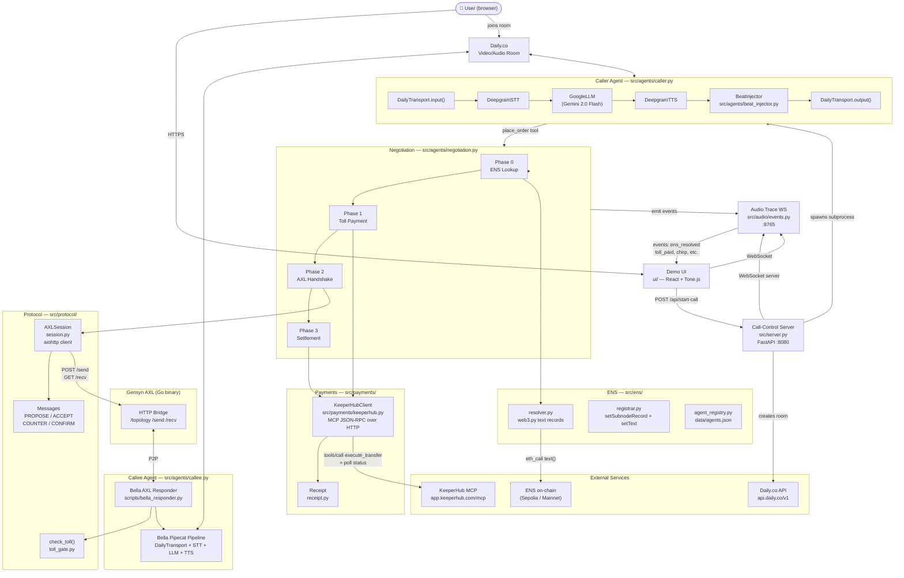
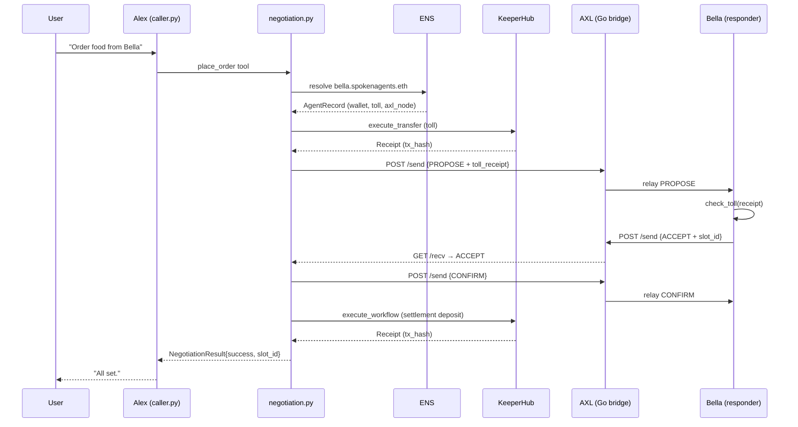

# Tollgate Architecture

```mermaid
flowchart TD
    User(["👤 User (browser)"])
    UI["Demo UI\nui/ — React + Tone.js"]
    Server["Call-Control Server\nsrc/server.py\nFastAPI :8080"]
    TraceWS["Audio Trace WS\nsrc/audio/events.py\n:8765"]
    Daily["Daily.co\nVideo/Audio Room"]

    subgraph CallerAgent["Caller Agent — src/agents/caller.py"]
        DailyIn["DailyTransport.input()"]
        STT["DeepgramSTT"]
        LLM["GoogleLLM\n(Gemini 2.0 Flash)"]
        TTS["DeepgramTTS"]
        Beat["BeatInjector\nsrc/agents/beat_injector.py"]
        DailyOut["DailyTransport.output()"]
        DailyIn --> STT --> LLM --> TTS --> Beat --> DailyOut
    end

    subgraph Negotiation["Negotiation — src/agents/negotiation.py"]
        Phase0["Phase 0\nENS Lookup"]
        Phase1["Phase 1\nToll Payment"]
        Phase2["Phase 2\nAXL Handshake"]
        Phase3["Phase 3\nSettlement"]
        Phase0 --> Phase1 --> Phase2 --> Phase3
    end

    subgraph ENS["ENS — src/ens/"]
        Resolver["resolver.py\nweb3.py text records"]
        Registrar["registrar.py\nsetSubnodeRecord + setText"]
        Registry["agent_registry.py\ndata/agents.json"]
    end

    subgraph Payments["Payments — src/payments/"]
        KH["KeeperHubClient\nsrc/payments/keeperhub.py\nMCP JSON-RPC over HTTP"]
        Receipt["Receipt\nreceipt.py"]
        KH --> Receipt
    end

    subgraph AXL["Gensyn AXL (Go binary)"]
        AXLBridge["HTTP Bridge\n/topology  /send  /recv"]
    end

    subgraph Protocol["Protocol — src/protocol/"]
        Session["AXLSession\nsession.py\naiohttp client"]
        Messages["Messages\nPROPOSE / ACCEPT\nCOUNTER / CONFIRM"]
        TollGate["check_toll()\ntoll_gate.py"]
        Session --> Messages
    end

    subgraph CalleeAgent["Callee Agent — src/agents/callee.py"]
        BellaVoice["Bella Pipecat Pipeline\nDailyTransport + STT + LLM + TTS"]
        Responder["Bella AXL Responder\nscripts/bella_responder.py"]
    end

    subgraph ExternalServices["External Services"]
        ENS_Chain["ENS on-chain\n(Sepolia / Mainnet)"]
        KH_API["KeeperHub MCP\napp.keeperhub.com/mcp"]
        Daily_API["Daily.co API\napi.daily.co/v1"]
    end

    User -->|"HTTPS"| UI
    UI -->|"POST /api/start-call"| Server
    UI -->|"WebSocket"| TraceWS
    Server -->|"spawns subprocess"| CallerAgent
    Server -->|"creates room"| Daily_API

    CallerAgent -->|"place_order tool"| Negotiation
    Negotiation -->|"emit events"| TraceWS
    Negotiation --> Phase0
    Phase0 --> Resolver
    Resolver -->|"eth_call text()"| ENS_Chain
    Phase1 --> KH
    KH -->|"tools/call execute_transfer\n+ poll status"| KH_API
    Phase2 --> Session
    Session -->|"POST /send\nGET /recv"| AXLBridge
    AXLBridge <-->|"P2P"| Responder
    Phase3 --> KH

    Responder --> TollGate
    Responder --> BellaVoice

    User -->|"joins room"| Daily
    Daily <--> CallerAgent
    Daily <--> BellaVoice

    Server -->|"WebSocket server"| TraceWS
    TraceWS -->|"events: ens_resolved\ntoll_paid, chirp, etc."| UI
```

## Message sequence

```mermaid
sequenceDiagram
    participant U as User
    participant A as Alex (caller.py)
    participant N as negotiation.py
    participant E as ENS
    participant K as KeeperHub
    participant X as AXL (Go bridge)
    participant B as Bella (responder)

    U->>A: "Order food from Bella"
    A->>N: place_order tool
    N->>E: resolve bella.spokenagents.eth
    E-->>N: AgentRecord (wallet, toll, axl_node)
    N->>K: execute_transfer (toll)
    K-->>N: Receipt (tx_hash)
    N->>X: POST /send  {PROPOSE + toll_receipt}
    X->>B: relay PROPOSE
    B->>B: check_toll(receipt)
    B->>X: POST /send  {ACCEPT + slot_id}
    X-->>N: GET /recv → ACCEPT
    N->>X: POST /send  {CONFIRM}
    X->>B: relay CONFIRM
    N->>K: execute_workflow (settlement deposit)
    K-->>N: Receipt (tx_hash)
    N-->>A: NegotiationResult{success, slot_id}
    A-->>U: "All set."
```
