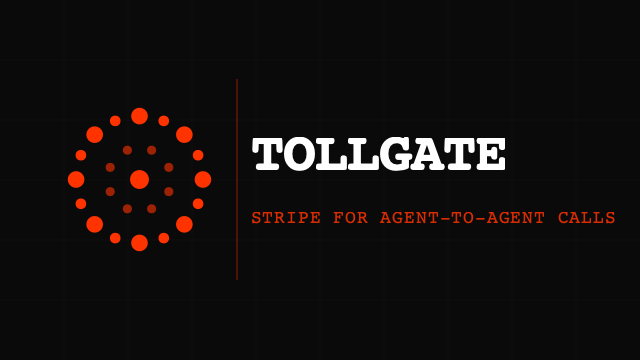
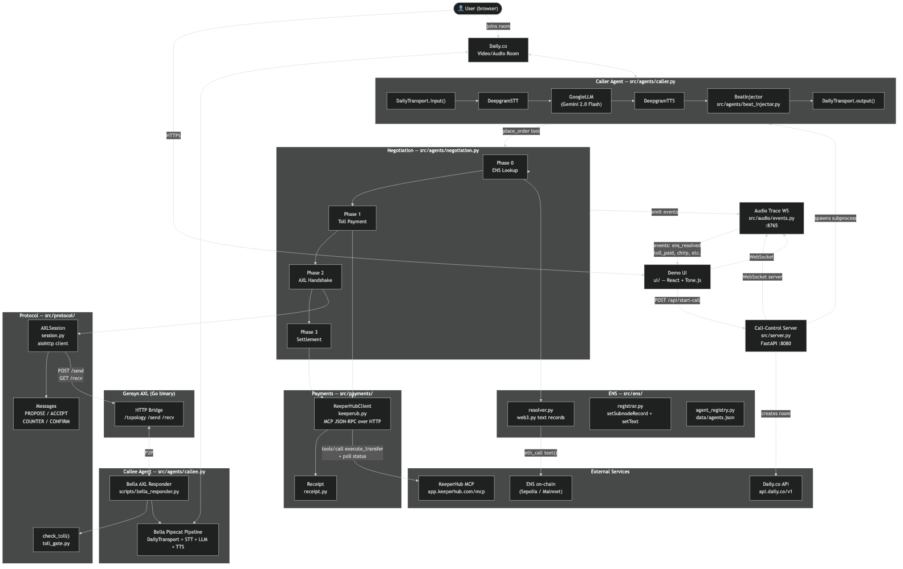
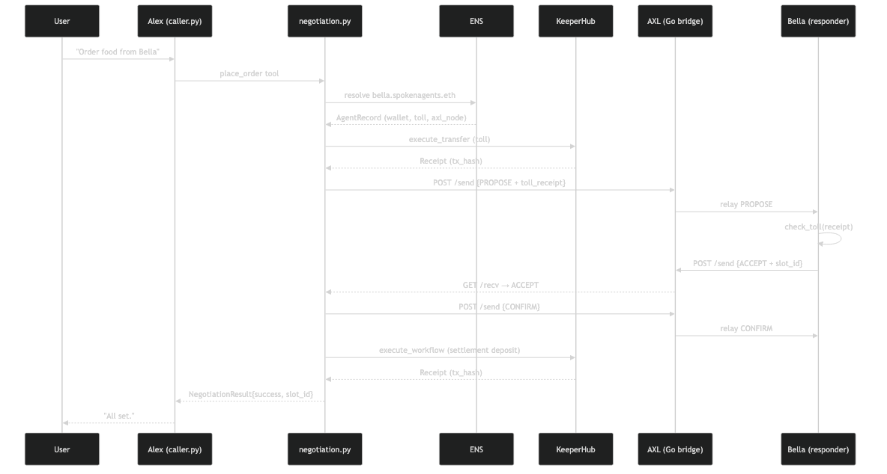

# SpokenAgents (Tollgate)

[](tests/)

**KeeperHub Builder Feedback Bounty:** This repo includes our **submission-ready builder feedback** (UX/UI friction, reproducible issues, documentation gaps, feature requests) in [`KEEPERHUB_BUILDER_FEEDBACK_BOUNTY.md`](./KEEPERHUB_BUILDER_FEEDBACK_BOUNTY.md), with a shorter companion in [`FEEDBACK.md`](./FEEDBACK.md).



**Stripe for agent-to-agent calls.** A paid-inbound layer for voice AI: to open a channel with another agent, the caller pays a toll on-chain via [KeeperHub](https://keeperhub.com). Negotiation runs over [Gensyn AXL](https://gensyn.ai). Each agent’s identity, toll, and capabilities are advertised on **ENS** (including `*.spokenagents.eth` subnames).

Demo stack: **Alex** (caller) uses **Pipecat** with **Daily.co**, **Deepgram** STT/TTS, and **Google Gemini**; **Bella** (callee) is optional via **LiveKit Agents**. A small **FastAPI** control plane spawns the caller and exposes agent registry APIs.

> Built for ETHGlobal Open Agents.

- 📜 **Pitch:** [`project-idea.mdx`](./project-idea.mdx) · **Prize tracks:** [`prizes.md`](./prizes.md) · **Architecture:** [`ARCHITECTURE.md`](./ARCHITECTURE.md) · **KeeperHub bounty feedback:** [`KEEPERHUB_BUILDER_FEEDBACK_BOUNTY.md`](./KEEPERHUB_BUILDER_FEEDBACK_BOUNTY.md) · [`FEEDBACK.md`](./FEEDBACK.md)

## Clone

```bash
git clone https://github.com/Ashar20/spokenagents.git
cd spokenagents
```

## The problem

Voice agents are becoming universal front doors. Without postage or pricing at the protocol edge, agent-to-agent spam scales like robocalls. This repo implements a **toll booth**: resolve a callee on ENS, pay a published toll, then negotiate over AXL before the human-level voice conversation proceeds.

## How it works (high level)

1. The human asks Alex’s agent to act (e.g. book at Bella).
2. Alex resolves the callee’s ENS record → AXL bridge URL, toll **price**, KeeperHub **workflow** id, **wallet**, capabilities.
3. Alex pays the inbound toll through KeeperHub; negotiation messages flow over **AXL** (`PROPOSE` → `ACCEPT` / `COUNTER` → `CONFIRM`), with optional beat sonification on the Daily audio path.
4. On success, settlement can run via KeeperHub; both sides summarize for the human.

## Architecture

Rendered diagrams (from editable Mermaid sources):

| Flow | Source |
|------|--------|
| System overview | [`docs/architecture-flowchart.mmd`](docs/architecture-flowchart.mmd) |
| Negotiation sequence | [`docs/architecture-sequence.mmd`](docs/architecture-sequence.mmd) |

<p align="center">
  <br/>
  <sub>System flow — Pipecat/Daily caller, FastAPI, ENS, AXL, KeeperHub</sub>
</p>

<p align="center">
  <br/>
  <sub>ENS → toll → AXL → confirm → settlement</sub>
</p>

Long-form narrative and an alternate Mermaid embed live in **[ARCHITECTURE.md](ARCHITECTURE.md)**.

## What the code actually does

| Piece | Role |
|--------|------|
| [`src/agents/caller.py`](src/agents/caller.py) | **Alex** — Pipecat pipeline: Daily transport, Deepgram STT/TTS, Gemini (`GoogleLLMService`), `place_order` tool → ENS + toll + AXL + audio events |
| [`src/agents/callee.py`](src/agents/callee.py) | **Bella (optional)** — LiveKit Agents voice assistant (OpenAI stack); run when you want a separate LiveKit callee |
| [`scripts/bella_responder.py`](scripts/bella_responder.py) | Headless **Bella AXL responder**: verifies toll receipt, role, responds over `AXLSession` |
| [`src/server.py`](src/server.py) | **FastAPI** on `:8080`: Daily room creation, spawn Alex process, `POST /api/start-call`, `POST /api/end-call`, agent registry routes |
| Lifespan | Starts **trace WebSocket** server on **`ws://localhost:8765`** via `AudioEventEmitter.serve()` for UI telemetry (chirps, ENS/toll events) |
| Registry API | **`POST /api/agents/register`** — ENS subdomain + text records for labels under `spokenagents.eth`; **`GET /api/agents`** — list tracked agents (`?resolved=true` for full records) |

Local agent names tracked for demos live in [`data/agents.json`](data/agents.json):

- `alex.spokenagents.eth`
- `bella.spokenagents.eth`
- `wendy.spokenagents.eth`

## Sponsor integrations

### Gensyn AXL

- Go **AXL node** + HTTP bridge (`/topology`, `/send`, `/recv`).
- Session client: [`src/protocol/session.py`](src/protocol/session.py); message types: [`src/protocol/messages.py`](src/protocol/messages.py).
- Callee-side automation for toll + accept path: [`scripts/bella_responder.py`](scripts/bella_responder.py) (run beside the Bella bridge).

### KeeperHub

- Client: [`src/payments/keeperhub.py`](src/payments/keeperhub.py).
- Talks to **`https://app.keeperhub.com/mcp`** with **JSON-RPC over HTTP**, `Authorization: Bearer <KEEPERHUB_API_KEY>`, `Accept: application/json, text/event-stream` (MCP/SSE-friendly).
- Uses MCP tools such as **`execute_transfer`** and polls **`get_direct_execution_status`** until terminal state, then maps to [`Receipt`](src/payments/receipt.py).
- `KeeperHubClient` manages MCP session **`initialize`** / **`initialized`** handshake under a lock to avoid partial init races.
- Toll shape in code: [`TollPaymentRequest`](src/payments/keeperhub.py) (workflow id from ENS `contact.workflow`, wallets from records).

### ENS

- Resolution: [`src/ens/resolver.py`](src/ens/resolver.py) via `web3.py` and standard **Resolver.text** API.
- On-chain registration for subnames: [`src/ens/registrar.py`](src/ens/registrar.py) — **registry** and **public resolver** addresses used in code:

  - **ENS registry:** `0x00000000000C2E074eC69A0dFb2997BA6C7d2e1e`
  - **Public resolver:** `0x8FADE66B79cC9f707aB26799354482EB93a5B7dD`

  (Configure `RPC_URL` in `.env` for your chain; defaults in [`.env.example`](.env.example) point at Base Sepolia–compatible RPC for experiments.)

- Text keys include `agent.role`, `axl.node`, `axl.bridge_url`, `contact.wallet`, `contact.price`, `contact.currency`, `contact.workflow`, `capabilities`, `agent.version`.

## Project layout

```
spokenagents/
├── src/
│   ├── server.py              # FastAPI + lifespan (trace WS :8765)
│   ├── agents/
│   │   ├── caller.py          # Pipecat + Daily + Deepgram + Gemini
│   │   ├── callee.py          # LiveKit Agents (optional Bella)
│   │   ├── negotiation.py     # ENS + KeeperHub + AXL flow
│   │   └── beat_injector.py   # AXL beat sonification
│   ├── protocol/              # AXL session + messages + toll gate
│   ├── payments/              # keeperhub.py, receipt.py
│   ├── ens/                   # resolver, registrar, agent_registry
│   └── audio/events.py       # Trace WS + AudioEventEmitter
├── ui/                        # Vite + React demo (Tone.js)
├── tests/                     # 58 pytest tests
├── scripts/
│   ├── bella_responder.py     # AXL responder for Bella
│   ├── gen_brand_assets.py    # PNG banner/logo from SVG
│   ├── register_ens.py
│   └── keeperhub_smoke_test.py
├── docs/
│   ├── architecture-flowchart.mmd
│   └── architecture-sequence.mmd
└── data/agents.json           # tracked *.spokenagents.eth names
```

## Setup

### Prerequisites

- Python **3.11+**
- Node **18+** (for `ui/`)
- API keys: **Daily**, **Deepgram**, **Google AI (Gemini)** for Alex; **KeeperHub**; optional **LiveKit** + **OpenAI** for Bella
- Running **AXL** bridges for your dev topology

### Install

```bash
cp .env.example .env
# Fill .env — see comments in .env.example

python -m venv .venv && source .venv/bin/activate
pip install -e ".[dev]"
pip install "livekit-agents[openai]>=0.8" aiohttp websockets  # if using callee.py

cd ui && npm install && cd ..
```

### Tests

```bash
source .venv/bin/activate
pytest -q
```

**58** tests under `tests/` should pass.

### Run the demo (typical)

**1 — FastAPI + trace socket**

```bash
source .venv/bin/activate
uvicorn src.server:app --port 8080
```

**2 — UI**

```bash
cd ui && npm run dev
# http://localhost:5173
```

**3 — Start Alex after `/api/start-call` creates a room** (or run caller manually with `DAILY_ROOM_URL` set):

```bash
source .venv/bin/activate
python -m src.agents.caller
```

**4 — AXL + Bella responder** (when exercising full negotiate path):

```bash
source .venv/bin/activate
python -m scripts.bella_responder
```

**Optional — LiveKit Bella voice agent**

```bash
source .venv/bin/activate
python -m src.agents.callee dev
```

## API examples

Health:

```bash
curl -sS http://localhost:8080/api/health
```

List registered agent names:

```bash
curl -sS "http://localhost:8080/api/agents"
```

Register a subname under `spokenagents.eth` (requires server env for owner key / RPC — see registrar):

```bash
curl -sS -X POST "http://localhost:8080/api/agents/register" \
  -H "Content-Type: application/json" \
  -d '{
    "label": "wendy",
    "role": "callee",
    "axl_node": "<64-char-hex>",
    "axl_bridge_url": "http://127.0.0.1:9012",
    "wallet": "0xYourWallet",
    "toll_price": "0.05",
    "workflow_id": "your/inbound-toll",
    "capabilities": ["dining"]
  }'
```

## Brand assets

Regenerate **logo** and **banner** PNGs:

```bash
source .venv/bin/activate
python scripts/gen_brand_assets.py
```

## Team & links

| | |
|--|--|
| **Repo** | https://github.com/Ashar20/spokenagents.git |
| **Docs** | [ARCHITECTURE.md](ARCHITECTURE.md) · Mermaid sources in `docs/` |

## License

See repository license file (if present) or project root metadata.
